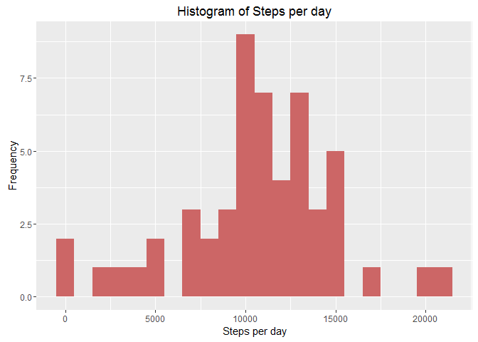
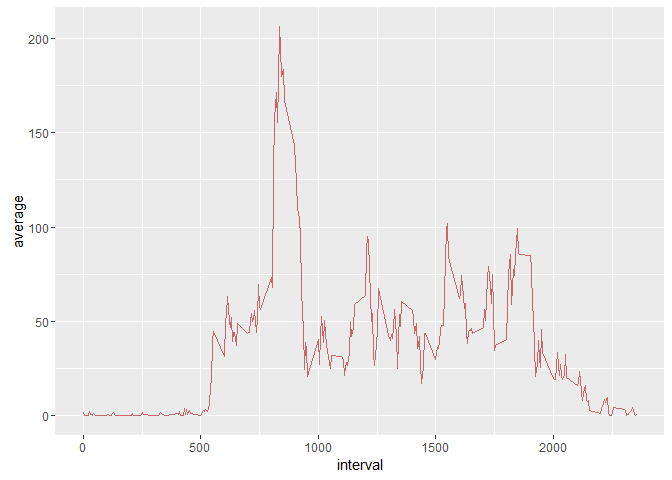

# Reproducible Research: Peer Assessment 1

# Introduction
This assignment makes use of data from a personal activity monitoring device. This device collects data at 5 minute intervals through out the day. The data consists of two months of data from an anonymous individual collected during the months of October and November, 2012 and include the number of steps taken in 5 minute intervals each day.

###

## Loading and preprocessing the data

Loading the data from the "activity.csv" file and inspecting it.


```r
dat <- read.csv("activity.csv", stringsAsFactors=F)
head(dat)
```

```
##   steps       date interval
## 1    NA 2012-10-01        0
## 2    NA 2012-10-01        5
## 3    NA 2012-10-01       10
## 4    NA 2012-10-01       15
## 5    NA 2012-10-01       20
## 6    NA 2012-10-01       25
```

```r
summary(dat)
```

```
##      steps            date              interval     
##  Min.   :  0.00   Length:17568       Min.   :   0.0  
##  1st Qu.:  0.00   Class :character   1st Qu.: 588.8  
##  Median :  0.00   Mode  :character   Median :1177.5  
##  Mean   : 37.38                      Mean   :1177.5  
##  3rd Qu.: 12.00                      3rd Qu.:1766.2  
##  Max.   :806.00                      Max.   :2355.0  
##  NA's   :2304
```

```r
str(dat)
```

```
## 'data.frame':	17568 obs. of  3 variables:
##  $ steps   : int  NA NA NA NA NA NA NA NA NA NA ...
##  $ date    : chr  "2012-10-01" "2012-10-01" "2012-10-01" "2012-10-01" ...
##  $ interval: int  0 5 10 15 20 25 30 35 40 45 ...
```
We notice some NA values and decide to ignore these in answering the next two questions. 

## What is mean total number of steps taken per day?

Using the `dplyr` package, we filter out the NA values, group the data by date and sum up the number of steps per day - giving us the total number of steps per day.


```r
dat_tbl <- tbl_df(dat)
freq_dat <- dat_tbl %>%
            filter(!is.na(steps)) %>%
            group_by(date) %>% 
            summarize(sum = sum(steps, na.rm=T))

g <- ggplot(freq_dat, aes(x=sum)) +
     geom_histogram(fill = "#CC6666", binwidth = 1000) +
     labs(title = "Histogram of Steps per day", 
          x = "Steps per day", y = "Frequency")
plot(g)
```



The mean and median of steps per day


```r
#mean and median of steps per day
mean_dat <- mean(freq_dat$sum)
mean_dat
```

```
## [1] 10766.19
```

```r
median_dat <- median(freq_dat$sum)
median_dat
```

```
## [1] 10765
```

## What is the average daily activity pattern?

Once again, the `dplyr` - filter out the NA values, this time, group by interval and calculate the mean value for steps per interval.


```r
interval_dat <- dat_tbl %>%
                filter(!is.na(steps)) %>%
                group_by(interval) %>%
                summarize(average = mean(steps))

g <- ggplot(interval_dat, aes(x=interval, y=average)) +
    geom_line(color = "#CC6666")
plot(g)
```



```r
### max value
interval_dat[which.max(interval_dat$average),]
```

```
## Source: local data frame [1 x 2]
## 
##   interval  average
##      (int)    (dbl)
## 1      835 206.1698
```

We observe that the interval `835` shows the maximum number of steps. 


## Imputing missing values

For imputing missing values, we use the average value of the number of steps in the same 5-min interval.


```r
sum(is.na(dat))
```

```
## [1] 2304
```

```r
misses <- is.na(dat$steps)
avgs <- tapply(dat$steps, dat$interval, mean, na.rm=T)
dat$steps[misses] <- avgs[as.character(dat$interval[misses])]

#all gone
sum(is.na(dat$steps))
```

```
## [1] 0
```

## Are there differences in activity patterns between weekdays and weekends?

Using the `dplyr` again to qualify each date as a weekday or weekend.


```r
dat$date <- as.Date(dat$date)
week_dat <- mutate(dat, weektype = ifelse(weekdays(dat$date) == "Saturday" |
                                          weekdays(dat$date) == "Sunday", 
                                          "weekend", "weekday"))
week_dat$weektype <- as.factor(week_dat$weektype)
head(week_dat)
```

```
##       steps       date interval weektype
## 1 1.7169811 2012-10-01        0  weekday
## 2 0.3396226 2012-10-01        5  weekday
## 3 0.1320755 2012-10-01       10  weekday
## 4 0.1509434 2012-10-01       15  weekday
## 5 0.0754717 2012-10-01       20  weekday
## 6 2.0943396 2012-10-01       25  weekday
```

```r
ano_interval_dat <- week_dat %>%
                    group_by(interval, weektype) %>%
                    summarize(steps = mean(steps))

g <- ggplot(ano_interval_dat, aes(x=interval, 
                                  y=steps, color = weektype)) +
     geom_line() +
     facet_wrap(~weektype, ncol = 1, nrow=2)
plot(g)
```


We observe (for this particular set of data) that the individual is more active during the earlier part of the day on weekdays (hitting the gym perhaps...), whereas on weekends, the activity levels are more uniformly distributed during the day.


